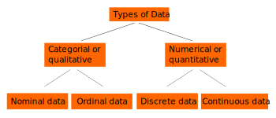



[Go back to the main page](../index.md)

# Data

## Index page

---

*Source: own work*

## Introduction

In statistics and data analysis, there are several ways to categorize different types of data. Two main categories of data are categorical and numerical.

**Categorical data**, also known as qualitative data, is data that can be divided into categories. There are two main types of categorical data: 
- nominal
- ordinal 

Nominal data is data that can be placed into categories without any inherent ordering. For example, "eye color" is a nominal data type, as there is no inherent order to the different categories (e.g. blue, brown, green, etc.).  
Ordinal data, on the other hand, is data that can be placed into categories and those categories have an order to them. Example ordinal data can be a "rating scale" in questionares, like "unsatisfied", "satisfied" and "very satisfied". 

**Numerical data**, also known as quantitative data, is data that can be measured and represented by numbers. There are two main types of numerical data: 
- discrete
- continuous

Discrete data can only take on specific, distinct values, such as whole numbers. Continuous data, on the other hand, can take on any value within a certain range.

---

## Topics:

- [Data Types](./data_02_data_types.md)
- [Data 1](link here)
- [Data 2](link here)
- [Data 3](link here)

>This web page is distributed under the terms of the Creative Commons Attribution License which permits unrestricted use, distribution, and reproduction in any medium, provided the original author and source are credited.
>Creative Commons License: CC BY-SA 4.0.

