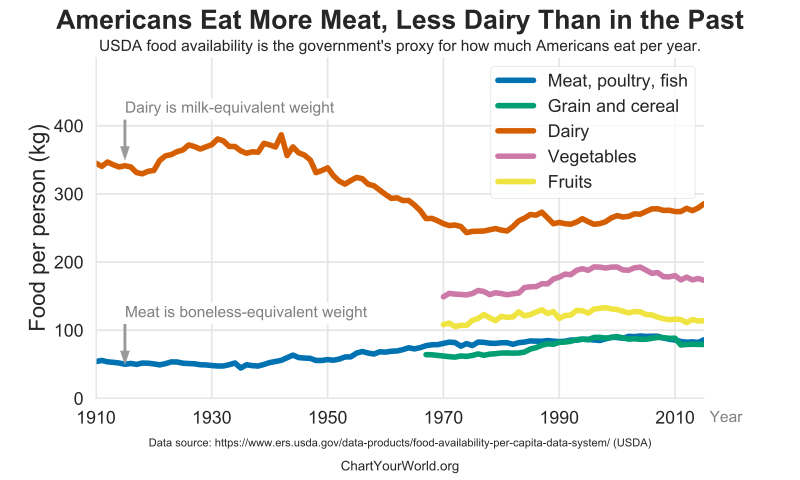



[Go back to the main page](../index.md)

# Data

## Index page

---

*Source: https://commons.wikimedia.org/wiki/File:US_Food_Consumption_Over_Time.svg*

## Introduction

### Categorial data and numerical data

In statistics and data analysis, there are several ways to categorize different types of data. Two main categories of data are categorical and numerical.

**Categorical data**, also known as qualitative data, is data that can be divided into categories. There are two main types of categorical data: 
- nominal
- ordinal 

Nominal data is data that can be placed into categories without any inherent ordering. For example, "eye color" is a nominal data type, as there is no inherent order to the different categories (e.g. blue, brown, green, etc.).  
Ordinal data, on the other hand, is data that can be placed into categories and those categories have an order to them. Example ordinal data can be a "rating scale" in questionares, like "unsatisfied", "satisfied" and "very satisfied". 

**Numerical data**, also known as quantitative data, is data that can be measured and represented by numbers. There are two main types of numerical data: 
- discrete
- continuous

Discrete data can only take on specific, distinct values, such as whole numbers. Continuous data, on the other hand, can take on any value within a certain range.

*Figure 1. Data types. Source: own work*

### Data scales

In statistics, data can be measured on different scales, which refers to the level of measurement of the data. The most commonly used scales of measurement are nominal, ordinal, interval, and ratio.

Nominal scale: This is the lowest level of measurement and is used for categorical data that can be divided into distinct groups or categories, with no inherent order or ranking. Examples include eye color, gender, or nationality.

Ordinal scale: This level of measurement is used for categorical data that can be ranked or ordered. Examples include surveys, where respondents are asked to rate their agreement with a statement on a scale from strongly disagree to strongly agree, or biological taxonomic ranks such as kingdom, phylum, class, order, family, genus and species.

Interval scale: This level of measurement is used for numerical data that can be ordered and has a meaningful zero point, but no true ratio comparisons between values. Examples include temperatures measured in Celsius or Fahrenheit, time in hours and minutes.

Ratio scale: This is the highest level of measurement, and it is used for numerical data that can be ordered and has a meaningful zero point, and true ratio comparisons between values. Examples include weight measured in kilograms, height measured in centimeters, or income measured in dollars.

It is important to note that ratio data allows for meaningful statement about the value of x is twice the value of y and interval data allows for meaningful statement about the distance of x and y but it doesn't allow statement like x is twice the value of y.

>Thus, for temperature it is appropriate to say that 20 degrees Kelvin is twice the temperature of 10 degrees Kelvin but you can not do this for temperature expressed in degrees Celsius as there is no absolute zero point.

*Figure 2. Scales of measurement in statistics. Source: own work*

### Visualization methods

As explained above, you can not perform ratio comparisons on interval data. In addition, not all visualizations types are appropriote for all data types.

So what can you do with the different data types?

- Nominal data: Calculate frequencies. Calculate a proportion (or percentage) by dividing the frequency by the total number of events (and multiply by 100 for the percentage). Proper visualisations of nominal data are Pie Charts and Bar Charts.  
- Ordinal data: you can do the same as for nominal data but after you have calculated frequencies and proportions you can also calculate percentiles (including the median), mode and interquartile ranges (IQR).  
- Continuous data: Same as for the previous data types but you can also summarize your data by calculating the mean, standard deviation and range. For visualizations you can use boxplots and histograms.  

As boxplots are used when you have a categorical grouping variable and a continuous outcome variable, it becomes clear that boxplots can not be used for nominal data.

---

## Topics:

- [Ecercises](./data_02_data_excersizes.md)
- [Solutions](./data_02_data_solutions.md)

>This web page is distributed under the terms of the Creative Commons Attribution License which permits unrestricted use, distribution, and reproduction in any medium, provided the original author and source are credited.
>Creative Commons License: CC BY-SA 4.0.

