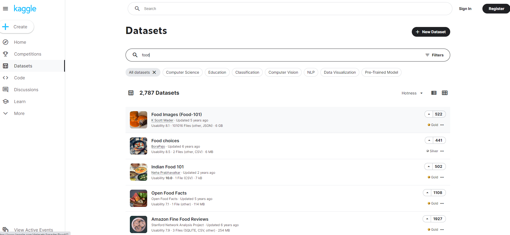



[Go back to the main page](../index.md)

# Master Gezonde en Duurzame Voeding

## Data Sets

---

*Source: own work*

## Data sets

### Ingredients and additives:
- [food-composition](https://www.kaggle.com/datasets/vinitshah0110/food-composition)
- [nutritional-values-for-common-foods-and-products](https://www.kaggle.com/datasets/trolukovich/nutritional-values-for-common-foods-and-products)
- [food-nutrition-dataset](https://www.kaggle.com/datasets/shrutisaxena/food-nutrition-dataset)
- [food-ingredient-lists](https://www.kaggle.com/datasets/datafiniti/food-ingredient-lists)
- [food-and-their-calories](https://www.kaggle.com/datasets/vaishnavivenkatesan/food-and-their-calories)
- [calories-in-food-items-per-100-grams](https://www.kaggle.com/datasets/kkhandekar/calories-in-food-items-per-100-grams)
- [indirect-food-additives](https://www.kaggle.com/datasets/fda/indirect-food-additives)
- [fooddata-central-nutrition-and-component-data](https://www.kaggle.com/datasets/stoicstatic/fooddata-central-nutrition-and-component-data)
- [list-of-ingredients-of-food-products](https://www.kaggle.com/datasets/rishidamarla/list-of-ingredients-of-food-products)

### Health, Allergens, allergies and hygiene:
- [food-allergens-and-allergies](https://www.kaggle.com/datasets/boltcutters/food-allergens-and-allergies)
- [uk-food-hygiene-rating-data-london](https://www.kaggle.com/datasets/datota/uk-food-hygiene-rating-data-london)
- [fried-food-consumption-and-mortality](https://www.kaggle.com/datasets/jleibow27/fried-food-consumption-and-mortality)
- [covid19-healthy-diet-dataset](https://www.kaggle.com/datasets/mariaren/covid19-healthy-diet-dataset)
- [eating-health-module-dataset](https://www.kaggle.com/datasets/bls/eating-health-module-dataset)
- [foodborne-diseases](https://www.kaggle.com/datasets/cdc/foodborne-diseases)

### Environmental issues, emission, supply chain, waste,pesticides:
- [foodproductemissions](https://www.kaggle.com/datasets/amandaroseknudsen/foodproductemissions)
- [food-balance-sheet-europe](https://www.kaggle.com/datasets/cameronappel/food-balance-sheet-europe)
- [pesticide-data-program-2015](https://www.kaggle.com/datasets/usdeptofag/pesticide-data-program-2015)
- [meatconsumption](https://www.kaggle.com/datasets/vagifa/meatconsumption)

### Taste, consumer experience and preferences:
- [umami-savoriness-in-food](https://www.kaggle.com/datasets/gonzalorecioc/umami-savoriness-in-food)
- [food-lovers-global-cuisine-preferences-survey](https://www.kaggle.com/datasets/themadprogramer/food-lovers-global-cuisine-preferences-survey)
- [food-choices](https://www.kaggle.com/datasets/borapajo/food-choices)
- [oreo-flavors-tastetest-ratings](https://www.kaggle.com/datasets/rtatman/oreo-flavors-tastetest-ratings)
- [milk-grading](https://www.kaggle.com/datasets/prudhvignv/milk-grading)
- [beer-profile-and-ratings-data-set](https://www.kaggle.com/datasets/ruthgn/beer-profile-and-ratings-data-set)

## Data generated for training purposes

### Practice file loading

A dataset to practice importing csv and tsv files in Excel and R.  
[Click here](./download_data_sets/01_file_loading.zip) to download a zip file.

The purpose of this excercise is simple: Load the data in a tibble using the read_delim function (or read_csv, read_csv2, read_tsv).
Check if this is done in an appropriate manner by printing your tibble.

The files:
The files in the folder contains some (fictive) gene-array data. The data set contains a selection of induced transcripts after some stimulus. The columns represent:
- the mRNA entry
- fold induction after some stimulus
- the protein entry number
- protein length in number of amino acids of the corresponding NP entry
- the protein family the protein belongs to
- the predicted cellular localization

Whatever the contents of a file, you always need to address (some of) these questions:

- Are there comment lines at the top?
- Is there a header line with column names?
- What is the column separator?
- Are there quotes around character data?
- How are missing values encoded?
- How are numeric values encoded?
- What is the type in each column?

### Skewed data to test non-parametric statistics

Right-skewed datasets used for non-parametric statistics training in [Jamovi](https://www.jamovi.org/).
Right click and choose `save link as...` in order to save the csv file.
- [Bodyweight 2 diets](./download_data_sets/02_bodyweight_data.csv).  
- [Bodyweight 3 diets](./download_data_sets/03_bodyweight_data_3_diets.csv).  

All files (including the solutions) can be found [here](./download_data_sets/02_non-parametric_statistics.zip).  

### Vitamin C dataset

A fictive dataset to practice creating boxplots.  
Download the zip [here](./download_data_sets/03_vitamin_c.zip).  

### Vitamin B12 dataset

Another fictive dataset to practice creating boxplots and histograms.  
Download the zip [here](./download_data_sets/04_vitamin_b12.zip).  

### Pie dataset

A fictive dataset to practice creating Pie charts.  
Download the zip [here](./download_data_sets/05_pie_chart.zip).  

### Potassium dataset

A fictive dataset to practice creating XY-scatter charts with multiple series.  
Download the zip [here](./download_data_sets/06_potassium_matrices.zip).  

---

>This web page is distributed under the terms of the Creative Commons Attribution License which permits unrestricted use, distribution, and reproduction in any medium, provided the original author and source are credited.
>Creative Commons License: CC BY-SA 4.0.

