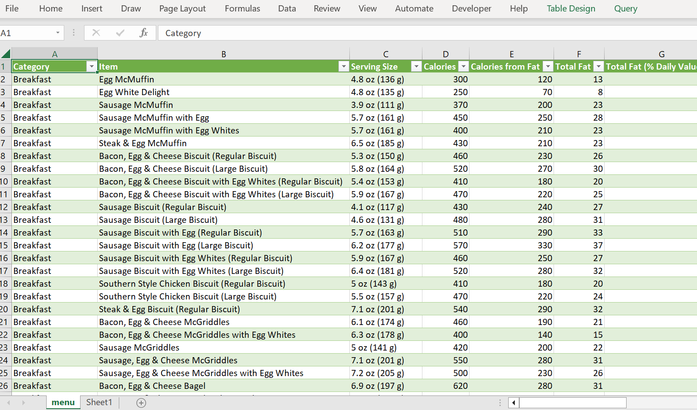
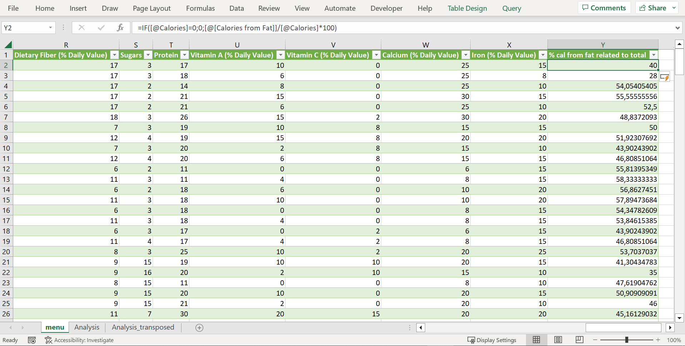
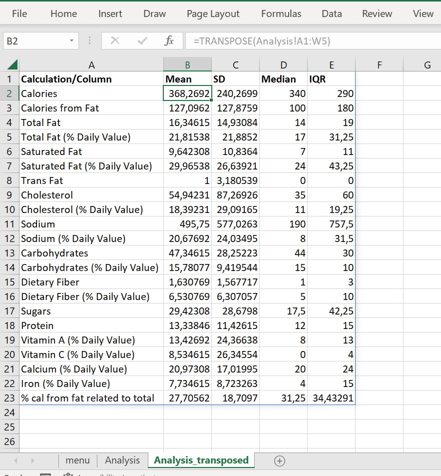
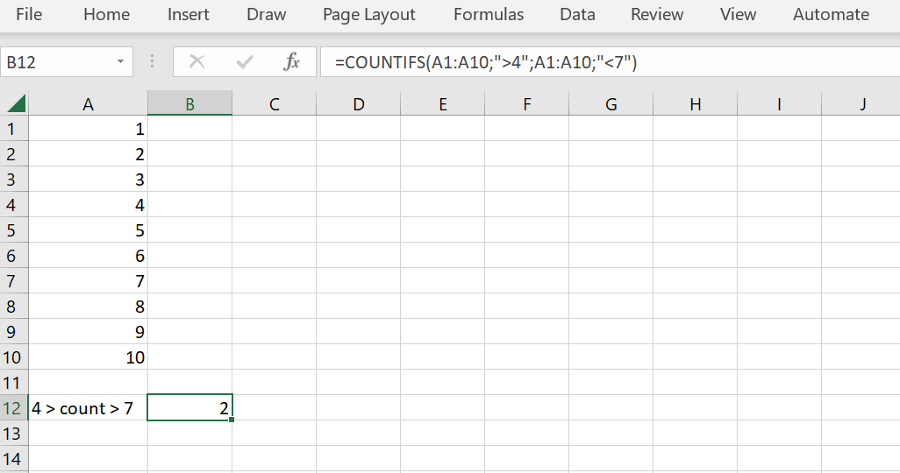
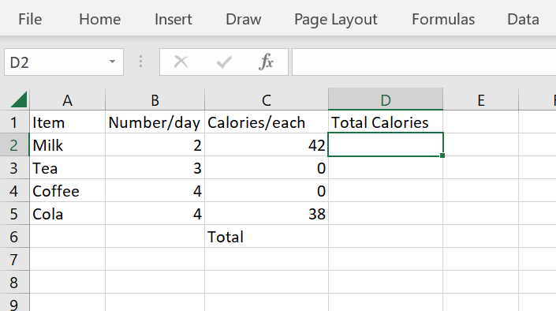
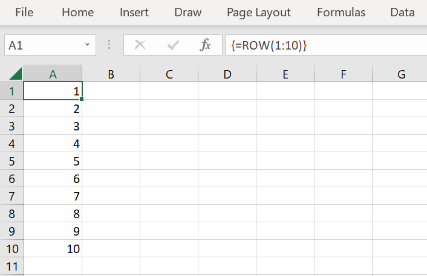
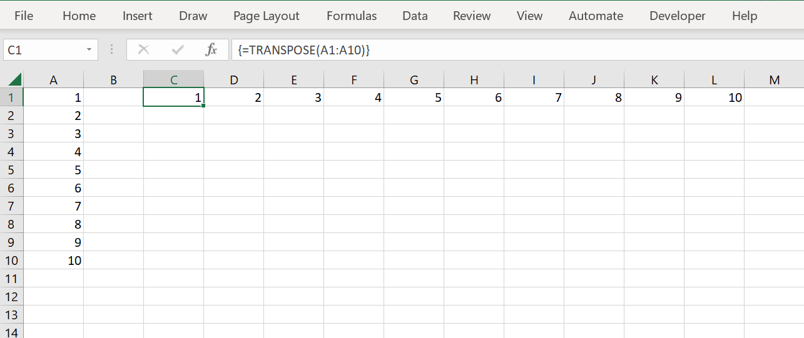




[Go back to the main page](../index.md)


# Excel: Data Analysis


*<sub>Figure 1: Data analysis of the flu pandemic around 1918. Source: New York Times</sub>*


## Introduction

Now that the data is imported and cleaned. It is time to analyse the data. 
This means that, depending on your specific question, you can do all sorts of calculations using Excel formulas (you can even create custom formulas), sort data, perform conditional formatting and create pivot tables. The creation of plots will be dealt with in the next chapter.


## How to organise your worksheet

Lets first discuss how to organize a worksheet.
[Nutrition facts data](https://www.kaggle.com/datasets/mcdonalds/nutrition-facts) from a fastfood restaurant was imported using the csv import function in Excel:


*<sub>Figure 2: Nutrition facts fastfood menu. Source: https://www.kaggle.com/datasets/mcdonalds/nutrition-facts</sub>*


Imagine that you would like to calculate the total percentage. Obviously, the easiest way to do this is to add a column to the table and calculate the sum of percentages using the `SUM` formula:

We first resize the table to the appropriate dimension:


*<sub>Figure 3: Resizing a table</sub>*

And then we can type the appropriate formula:


*<sub>Figure 4: Adding the formula</sub>*

However, it is better to get the output of calculations on whole columns on another sheet.
First of all, there might be new furure data records and you can perform calculations on whole columns (not restricted to a block of rows).
In addition, all the values from the column-based analysis can be linked to a variable.

Let's take the `AVERAGE` with `STDEV` and `MEDIAN` with `IQR` as an example:


*<sub>Figure 5: Data analysis on a seperate tab.</sub>*

Probably, you have noticed a problem with the organisation of this spreadsheet: Records should be in rows and variables in columns.
This is swabbed in the sheet above. So we should transpose the data. 

We can use the `TRANSPOSE` function to accomplish this.
The `TRANSPOSE` function is an array formula wich means that it can perform multiple calculations on one or more items in an array. The result is shown below:


*<sub>Figure 6: Result of the transposition of rows and columns.</sub>*

## The anatomy of a function

Excel has a lot of functions ready to use like the `SUM` function, the `AVERAGE` function and the `COUNTIF` function. You can even [create your own function in Excel](https://support.microsoft.com/en-us/office/create-custom-functions-in-excel-2f06c10b-3622-40d6-a1b2-b6748ae8231f) (which is beyond the scope of this course). If you frequently need to create your own function, you are probably better of with R or Python. But what is an function?

>In Microsoft Excel, a function is a built-in formula that is designed to perform a specific calculation. Functions can help you perform a wide range of calculations, from simple arithmetic operations such as addition, subtraction, and multiplication to more complex calculations such as statistical analysis and data manipulation. 

Excel functions are identified by their names, which typically begin with the equal sign (=) followed by the function name and any required arguments. For example, the SUM function adds up a range of numbers and is written as:

```
=SUM(A1:A10) 
```

where A1:A10 is the range of cells to be added.

Other functions require multiple arguments. For example, the COUNTIF function requires 2 arguments. An example notation for the COUNTIF function is written as:

```
=COUNTIF(A1:A10;">10")
```

where A1:A10 (the first argument) is the range of cells to be evaluated and ">10" (the secons argument) is the condition to be evaluated.

 
So the basic anatomy of a function is:

```
FUNCTIONNAME(ARGUMENT1;ARGUMENT2)
```

Note that Excel provides some help. Let's consider the `COUNTIFS` function.
The COUNTIFS function counts cells in a range based on one or more true or false condition. It is typed as:

```
=COUNTIFS(criteria_range1, criteria1, [criteria_range2, criteria2], ...)
```


*<sub>Figure 7: Excel provides suggestions for the arguments.</sub>*


The arguments are filled in and the function returns the result in cell A12:


*<sub>Figure 8: The result of the function is returned and shown in cell A12.</sub>*

So to summerize:

>In Microsoft Excel, a function is a built-in formula that is designed to perform a specific calculation. Arguments go in the function. This can be the value of one cell or a range of cells. Excel performs the calculation and the result will be returned in the cell where the formula was typed.

This is the standard behaviour of Excel but some functions in Excel are array functions. And they behave a bit different.

## Array functions

Excel now has the capability of array formulas. A single array formula can perform multiple calculations at once.
Let's have a look at an example:



*<sub>Figure 9: Small dataset to perform a calculation.</sub>*

What we would like to calculate is the total calories from all the beverages of a day. We can of course first calculate the total calories per drink and calculate the sum but using array formulas we can do it all at once:

```
=sum(B2:B5*C2:C5)
```


*<sub>Figure 10: The result of the array formula.</sub>*

As you can see, the answer is directly calculated. If you are not interested in the total calories of the individual beverages but just the total calories of all the beverages this will save you adding an extra column. You can put the calculation directly on an analysis tab.

There is just one detail left out. Although the formula works, it is adviced to press the keyboard shortcut CTRL + SHIFT + ENTER to complete the array formula. As a result, Microsoft Excel surrounds the formula with curly braces, which is an indication of an array formula so that people know that we are dealing with an array formula.


*<sub>Figure 11: Curly braces are a visual indication for an array formula.</sub>*

Array functions can return the result in a single cell (as the example above) or in multiple cells.

```
=ROW(1:10)
```


*<sub>Figure 12: Array function with a multiple cell output.</sub>*

Or the example that we have seen before:

```
=TRANSPOSE(A1:A10)
```


*<sub>Figure 13: Another array function with a multiple cell output.</sub>*

---

### Exersises and Solutions:


- [Exercises](./excel_09_data_analysis_exersises.md)
- [Solutions](./excel_10_data_analysis_solutions.md)

---


>This web page is distributed under the terms of the Creative Commons Attribution License which permits unrestricted use, distribution, and reproduction in any medium, provided the original author and source are credited.
>Creative Commons License: CC BY-SA 4.0.

