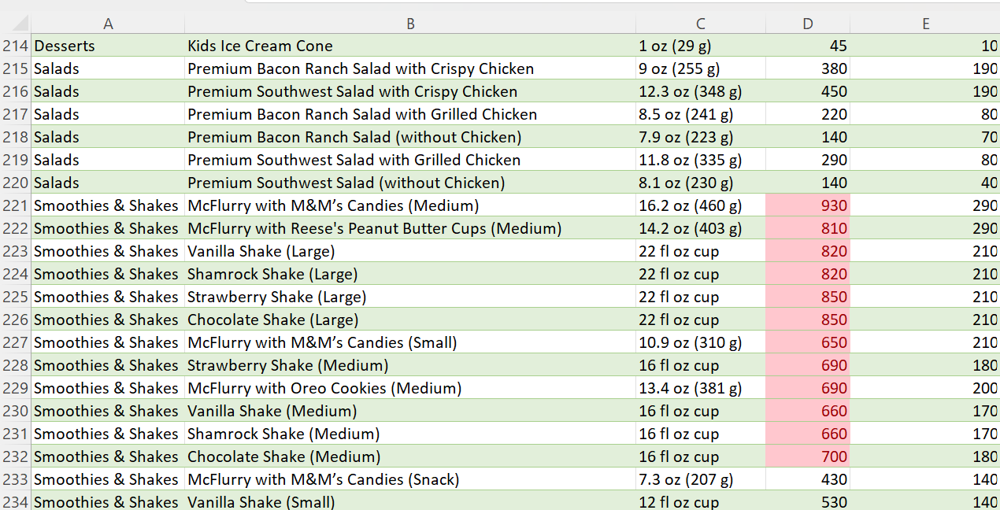
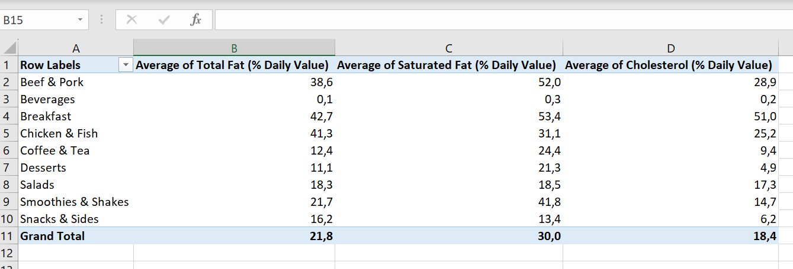




[Go back to the main page](../index.md)


# Excel Data Analysis

## Solutions

---

### Exercise 1

The excel file can be found [here](./files_10_data_analysis_solutions/exercise01/menu.xlsx).  
Screenshot of the table below:  


Examples of used functions:  

Minimum:  
```
=MIN(menu[Calories])
```
Maximum:  
```
=MAX(menu[Calories])
```
Average:  
```
=AVERAGE(menu[Calories])
```
Median:
```
=MEDIAN(menu[Calories])
```


### Exercise 2

1. Which item has the highest Calories from fat? 
>Chicken McNuggets (40 piece)  
2. Which items have the highest Iron (% Daily Value)? 
>Big Breakfast with Hotcakes (Regular Biscuit) and Big Breakfast with Hotcakes (Large Biscuit)  
3. Which Beef & Pork item has the lowest Calories from fat?
>Hamburger  
4. Which Coffee & Tea or Smoothies & Shakes item has the highest amount of carbohydrates?  
>Chocolate Shake (Large)  
5. Which item has the highest saturated fat and lowest carbohydrates value (use multi-sort to practice)?  
>Frappé Chocolate Chip (Large)  


### Exercise 3

1. high energetic: 37  

 ```
 =COUNTIF(menu[Calories];">600")
 ```

2. 300 > calories > 600: 106  

 ```
=COUNTIFS(menu[Calories];">300";menu[Calories];"<600")
 ```

3. count fl oz cup: 138  

 ```
=COUNTIF(menu[Serving Size];"*fl oz cup*")
 ```

### Exercise 4

1. Use conditional formatting to indicate high energetic food items (>600 calories). Use red markup for these. Which two categories show the highest number of red cells?  
>Breakfast and Chicken & Fish
2. Use conditional formatting to check for duplicate food items. Use red markup for these. Are there any duplicate items?  
>No
3. Use conditional formatting to indicate a % Dalily Value > 100% for Vitamin A. Which catagory are these items found?  
> Salads
4. Use conditional formatting to indicate a % Dalily Value >= 100% for Vitamin C. Use green markup for these. Make sure that you include 100%! How many items do you find?  
> 7


The excel file can be found [here](./files_10_data_analysis_solutions/exercise01/menu.xlsx).  




### Exercise 5

The excel file can be found [here](./files_10_data_analysis_solutions/exercise01/menu.xlsx).  




---


>This web page is distributed under the terms of the Creative Commons Attribution License which permits unrestricted use, distribution, and reproduction in any medium, provided the original author and source are credited.
>Creative Commons License: CC BY-SA 4.0.

