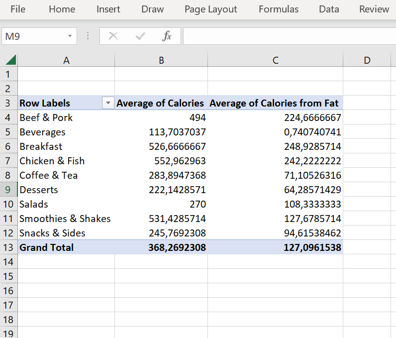
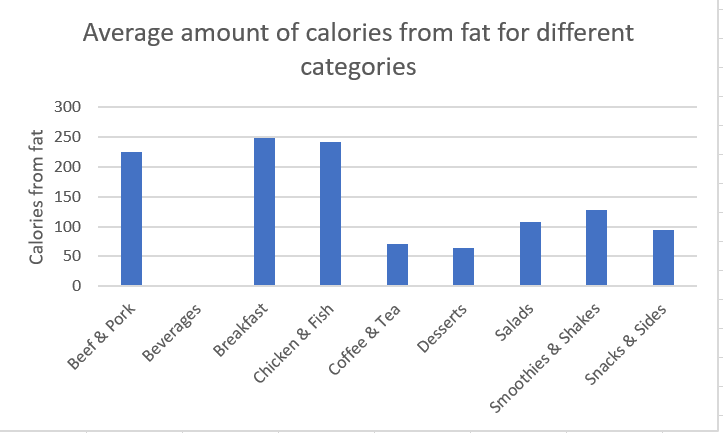
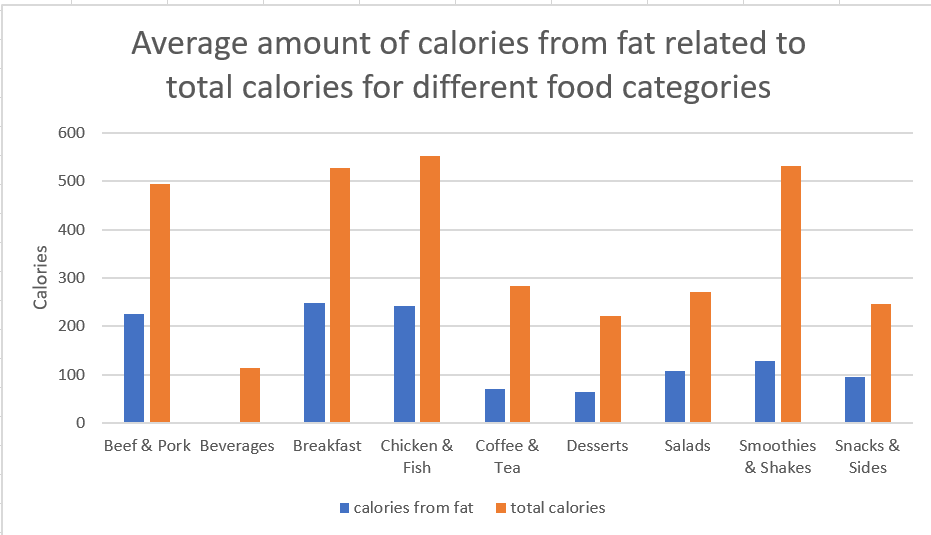
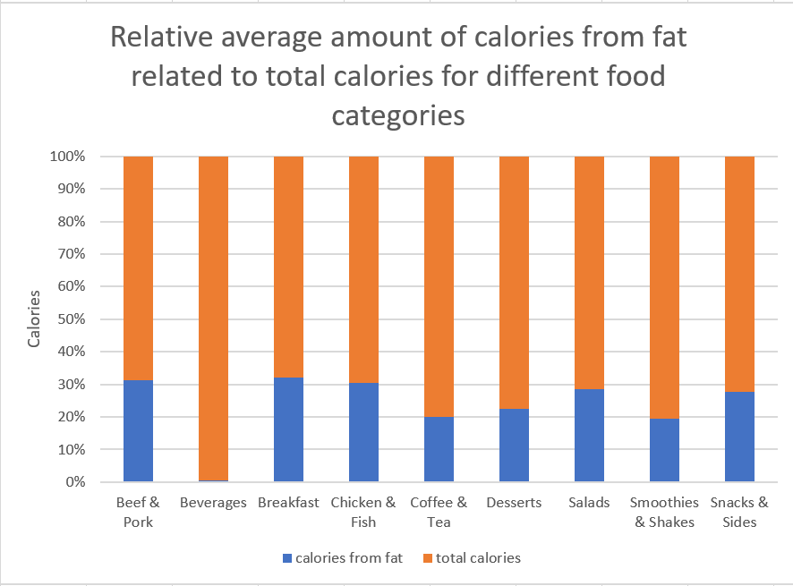
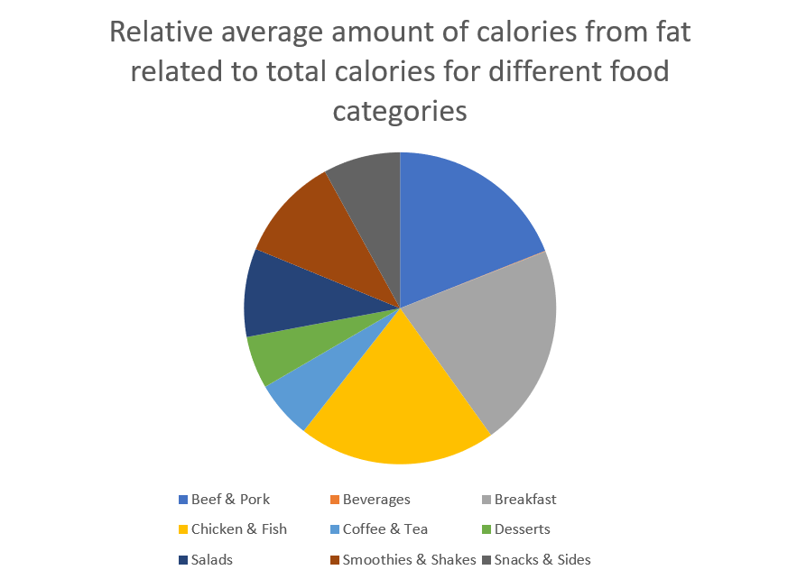



[Go back to the main page](../index.md)

# Excel: Data Visualization

*Figure 1: Data visualization of bacteria grown in the precence of anthocyanins isolated from red grapes.*

## Introduction

Though not as powerfull as R or Python, Excel is a user friendly tool for data analysis and visualization. Whether you're working in the food industry or conducting research on nutrition, Excel can help you make sense of your data and present your findings in a clear and compelling way. By using Excel's built-in charting features, you can easily create a variety of charts and graphs that visualize key trends and patterns in your data, such as changes in nutrient levels over time, differences between different food products, or correlations between different variables. With Excel, you can create professional-looking charts and graphs that are easy to understand and can help you communicate your insights to others. Excel offers a wide range of tools and capabilities that can help you make sense of your food-related data and present it in a way that is meaningful and informative.

## Data visualization charts in Excel

Excel offers a wide variety of chart types, which can be customized to suit your data and presentation needs. Some of the most commonly used chart types in Excel include:
- Column charts: Used to compare values across different categories or to show changes over time.
- Line charts: Used to show trends over time or to compare trends between multiple data sets.
- Pie charts: Used to show how different categories contribute to a whole.
- Bar charts: Similar to column charts, but with horizontal bars instead of vertical columns.
- Scatter charts: Used to show the relationship between two variables.
- Area charts: Similar to line charts, but with the area between the line and the x-axis filled in.
- Radar charts: Used to compare multiple data sets across different categories.
- Surface charts: Used to show trends in three-dimensional data.
- Bubble charts: Similar to scatter charts, but with bubbles of different sizes to represent the data points.

These are just a few of the chart types available in Excel. With its robust set of charting features, Excel offers a wide range of options for visualizing your data and communicating your insights to others.

## What makes a good chart?

A good chart is one that effectively communicates your data in a clear and concise manner. Here are some key characteristics of a good chart:
- Accuracy: The data in the chart should be accurate and clearly labeled. Any sources of error or uncertainty should be clearly indicated.
- Clarity: The chart should be easy to read and understand. The axes and labels should be clearly labeled (with units), and any legends or annotations should be concise and to the point.
- Simplicity: The chart should be simple and straightforward, avoiding unnecessary clutter or complexity (such as colored bars when they are not informative). The message of the chart should be clear and easily - understandable at a glance.
- Relevance: The chart should be relevant to the audience and the purpose of the presentation. It should highlight the key insights or trends in the data, and should be designed with the audience's needs and interests in mind.
- Aesthetics: The chart should be visually appealing and professional-looking, with clear, readable fonts and colors that complement the data being presented.

By focusing on these key characteristics, you can create charts that effectively communicate your data and insights, and help you to make better-informed decisions based on your data.

## Some chart examples

### Column charts

Column charts are suitable for comparing values across different categories or for showing changes in data over time. They are a popular and effective way to visually represent categorical data, and are often used to display data in the form of vertical bars.

>In Excel, charts with vertical bars are called column charts and bars with horizontal bars are called bar charts.

Column charts are particularly useful for:
- Comparing data: Column charts make it easy to compare data across different categories or groups, and to identify trends or patterns in the data.
- Showing changes over time: Column charts can be used to show changes in data over time, such as changes in sales or revenue from one year to the next.
- Highlighting differences: Column charts can be used to highlight differences between groups or categories, making it easy to see which values are larger or smaller than others.
- Displaying large amounts of data: Column charts can be used to display large amounts of data in a clear and concise manner, making it easy to interpret and analyze the data.

Overall, Column charts are a versatile and effective way to visualize categorical data and to communicate important insights and trends to others.

So let's take the pivot table from the fast food restaurant menu data as an example.
We have the average amount of total calories as well as the calories from fat of the different food categories.

*Figure 2: Pivot table showing the average amount of total calories as well as the calories from fat of the different food categories.*

What the data tell you is that meet and fish are high in fat and beverages are low (they are high in sugar). Not very surprising, but useful as an example. 

Let's first start with a Column chart for the average amount of calories from fat for the different food categories:

If you need more help (each individual step explained) hve a look [here](https://support.microsoft.com/en-us/office/present-your-data-in-a-column-chart-d89050ba-e6b6-47de-b090-e9ab353c4c00).

*Figure 3: Column chart representing the average amount of calories from fat per serving for different food categories in a fast food restaurant.*

>Note that providing different colors for each different bar does not provide extra information. It will confuse the reader.

Now if you would like to compare this to the total amount of calories, you could create a clustered column chart for this:

*Figure 4: Clustered column chart representing the average amount of calories from fat per serving related to the total amount of calories for different food categories in a fast food restaurant.*

>Note that providing different colors for each different set does provide extra information. Thus, it is highly recommended in this case.

But these data are difficult to compare. You could use a stacked column chart to have it all in one overview:

*Figure 5: Stacked column chart representing the average amount of calories from fat per serving related to the total amount of calories for different food categories in a fast food restaurant.*

But how do these calories from fat relate relatively to the total calories?
We could calculate this but Excel provides a plot type that takes this work out of your hands:

*Figure 6: Relative stacked column chart representing the relative average amount of calories from fat per serving related to the total amount of calories for different food categories in a fast food restaurant.*

Like the relative stacked column chart, the pie chart is another chart type that is suitable for such a representation.

## Pie Chart

Pie charts are suitable for displaying data that can be broken down into categories or parts that add up to a whole. They are often used to show proportions or percentages of a whole.

Pie charts are effective for conveying information quickly and intuitively, as the size of each slice corresponds to its percentage of the whole. They are also useful for highlighting the relative sizes of each category or part, making it easy to compare them at a glance.

However, pie charts may not be the best choice for all types of data. For example, they can become difficult to read when there are too many categories or when the differences between the sizes of the slices are small. In these cases, a bar chart or other visualization may be more appropriate.

We take our previous example as an example to create a pie chart:

*Figure 7: Pie chart representing the relative average amount of calories from fat per serving related to the total amount of calories for different food categories in a fast food restaurant.*

## Pivot charts

---

### Exersises and Solutions:

- [Exercises](./excel_12_data_visualization_exercises.md)
- [Solutions](./excel_13_data_visualization_solutions.md)

---

>This web page is distributed under the terms of the Creative Commons Attribution License which permits unrestricted use, distribution, and reproduction in any medium, provided the original author and source are credited.
>Creative Commons License: CC BY-SA 4.0.

