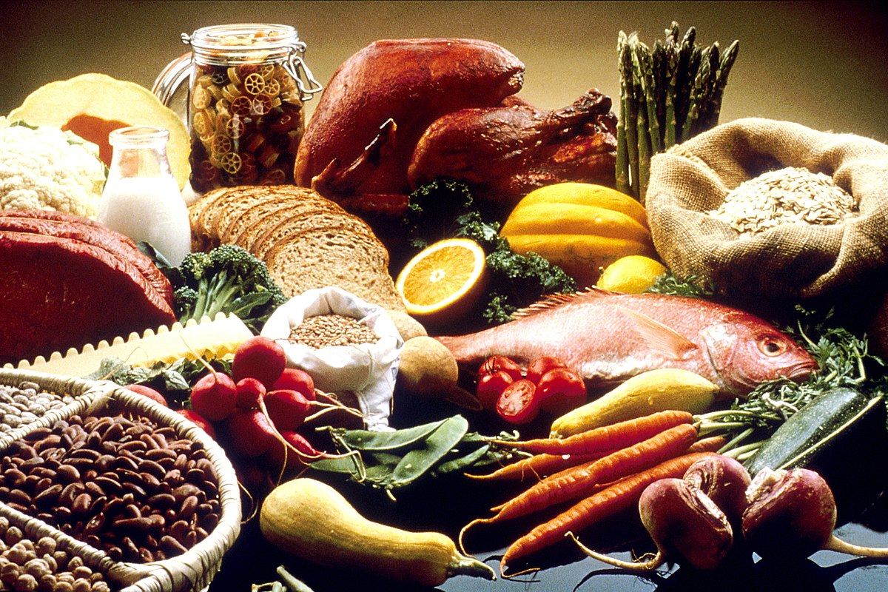



# Master Gezonde en Duurzame Voeding

## Cursus Data Analyse en Visualisatie

---

*Source: https://en.wikipedia.org/wiki/File:Good_Food_Display_-_NCI_Visuals_Online.jpg*

## Inleiding

Tijdens de gehele productieketen in de voedingsindustrie wordt veel data gegenereerd en geanalyseerd. Het doel van dit module-onderdeel is om je een korte introductie te geven in data analyse en visualisatie waardoor je een overzicht krijgt van wat data analyse en visualisatie inhoudt, zodat je later kan samenwerken met datawetenschappers in het werkveld. Je analyseert en visualiseert data gegenereerd door diverse sensoren tijdens de ontwikkel of productieketen, QC data afkomstig van de kwaliteitsafdeling, data afkomstig van consumentenenquêtes, data afkomstig uit laboratoriumonderzoeken naar gezondheidseffecten van voedselingrediënten of voedingsproducten en data met betrekking tot de geografische distributie van voedingsingrediënten. Tijdens dit module-onderdeel leer je verschillende typen data te onderscheiden en te analyseren. Je leert data aantrekkelijk te visualiseren voor rapportages. Er wordt vooral gewerkt met het spreadsheet programma Microsoft Excel maar er zal ook een introductie aan bod komen om data te analyseren met R en Python, momenteel de twee meest gebruikte programmeertalen in het werkveld. Dit laatste is vooral bedoeld om enige bekendheid te krijgen met de mogelijkheden van data analyse met R en Python maar niet om je alle ins en outs van programmeren te leren. De opdrachten die worden aangeboden mogen uitgewerkt worden met Excel, R of Python. Je mag zelf kiezen met welke software je de opdracht oplost. Dit module-onderdeel wordt afgesloten met een opdracht die je zelfstandig uitwerkt. Daarnaast dien je bij de integrale opdracht de geleerde kennis en vaardigheden met betrekking tot data analyse en visualisatie toe te passen in de rapportage.

## Koppeling met rol en werkveld  

Tijdens de gehele keten van ontwikkeling, opwerking en productie van voedingsingrediënten of producten wordt veel data gegenereerd en gebruikt. Denk hierbij aan data gegenereerd door diverse sensoren tijdens de ontwikkel of productieketen (temperatuur, druk, zuurgraad), QC data afkomstig van de kwaliteitsafdeling, data afkomstig van consumentenenquêtes, data afkomstig uit laboratoriumonderzoeken naar gezondheidseffecten van voedselingrediënten of voedingsproducten (bijvoorbeeld proefdieronderzoek) en data met betrekking tot de geografische distributie van voedingsingrediënten. De data gebruikt tijdens dit module-onderdeel komt zo veel als mogelijk uit het werkveld (projectpartners). Daarnaast worden datasets om te oefenen van Kaggle gebruikt. De analyses en rapportages zullen ook weer gedeeld worden met deze projectpartners.

## Leeruitkomsten

1.	De student analyseert verschillende typen data in Excel met behulp van diverse functies;
2.	De student visualiseert verschillende typen data in Excel met behulp van diverse plot typen;
3.	De student analyseert en visualiseert (korte kennismaking) data in RStudio met de programmeertaal R en Jupyter Notebooks met de programmeertaal Python.

## Link naar github:

Een voorbeeld opdracht met uitwerkingen is [hier](https://github.com/jurrehageman/master_food_data_analysis) te vinden.

## Inhoudsopgave

- Data analyse met Excel
- Data analyse met R
- Data analyse met Python

## Under construction

---

>This web page is distributed under the terms of the Creative Commons Attribution License which permits unrestricted use, distribution, and reproduction in any medium, provided the original author and source are credited.
>Creative Commons License: CC BY-SA 4.0.

