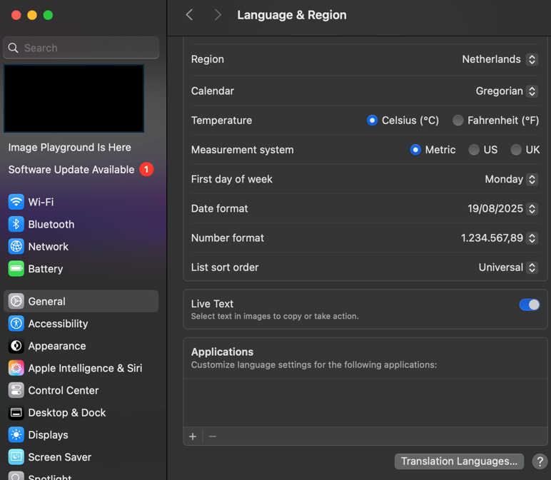




[Go back to the main page](../index.md)


# Installation

## Index page

---


## Windows Users


### MS Excel

As a student and employee of the Hanze University of Applied Sciences Groningen, you can download the latest version of Microsoft Office for free. This applies to both Windows and MacOS and can be done on up to five devices.

How does it work?

- Go to the website https://portal.office.com.  
- Log in with the login details you received from the Hanze.
- Follow the on-screen instructions to download and install Office.

Please note:  
- You need a valid Hanze email address to download Office.
- After your graduation or departure from the Hanze, you will no longer be able to use Office.

After the installation, it is recommended to set the Office display language to English (so that all functions are set to English).   
To do so, choose `File > More... > Options > Language > English`


*<sub>Figure 1. Set language to English</sub>*

In addition, set the decimal separator to a dot.  

`File > More... > Options > Advanced > Use system separators`

Here you can deselect this option and set the decimal separator to a dot and the thousands separator to a comma. 


*<sub>Figure 2. Set decimal separator</sub>*

At last, set PowerQuery to United States.

`Data > Get Data > Query Options > Regional Settings > English (United States)`


*<sub>Figure 3. Set Regional Settings for PowerQuery</sub>*

### R and RStudio

First download and install R at:  

https://cran.rstudio.com/

Download R for Windows. Choose install R for the first time.  
Download teh 64 bit package.  
Follow the on screen instructions and choose the default settings.

Next download and install RStudio at:  
https://posit.co/download/rstudio-desktop/

Choose DOWNLOAD RSTUDIO DESKTOP FOR WINDOWS.
Follow the on screen instructions and choose the default settings.

Install tidyverse in RStudio using:

```
install.packages("tidyverse")
```


## Mac Users


### MS Excel

As a student and employee of the Hanze University of Applied Sciences Groningen, you can download the latest version of Microsoft Office for free. This applies to both Windows and MacOS and can be done on up to five devices.

How does it work?

- Go to the website https://portal.office.com.  
- Log in with the login details you received from the Hanze.
- Follow the on-screen instructions to download and install Office.

Please note:  
- You need a valid Hanze email address to download Office.
- After your graduation or departure from the Hanze, you will no longer be able to use Office.

After the installation, it is recommended to set the Office display language to English (so that all functions are set to English).   

To do so, choose `bla`


*<sub>Figure 1. Set language to English</sub>*

In addition, set the decimal separator to a dot.  

`File > More... > Options > Advanced > Use system separators`

Here you can deselect this option and set the decimal separator to a dot and the thousands separator to a comma. 


*<sub>Figure 2. Set decimal separator</sub>*

At last, set PowerQuery to United States.

`Data > Get Data > Query Options > Regional Settings > English (United States)`


*<sub>Figure 3. Set Regional Settings for PowerQuery</sub>*


*<sub>Figure 3. Set Regional Settings for PowerQuery</sub>*

### R and RStudio

First download and install R at:  

https://cran.rstudio.com/

Download R for Windows. Choose install R for the first time.  
Download teh 64 bit package.  
Follow the on screen instructions and choose the default settings.

Next download and install RStudio at:  
https://posit.co/download/rstudio-desktop/

Choose DOWNLOAD RSTUDIO DESKTOP FOR WINDOWS.
Follow the on screen instructions and choose the default settings.

Install tidyverse in RStudio using:

```
install.packages("tidyverse")
```


>This web page is distributed under the terms of the Creative Commons Attribution License which permits unrestricted use, distribution, and reproduction in any medium, provided the original author and source are credited.
>Creative Commons License: CC BY-SA 4.0.

