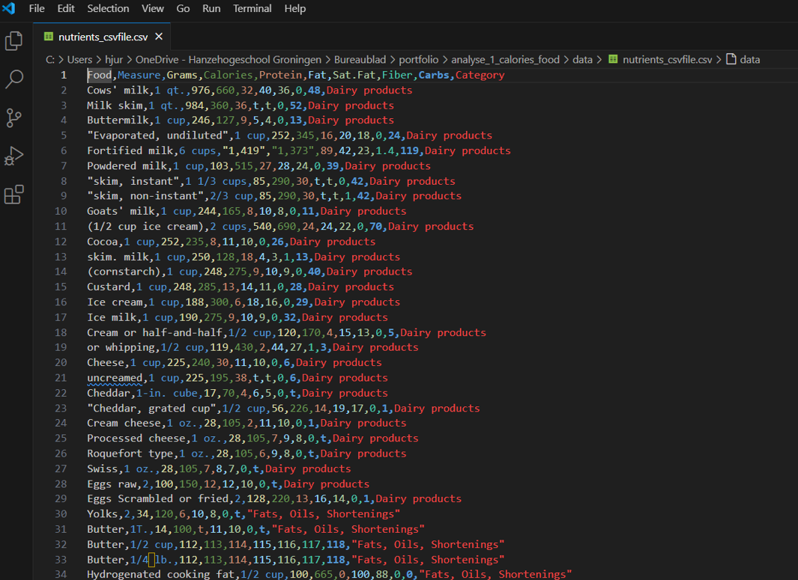
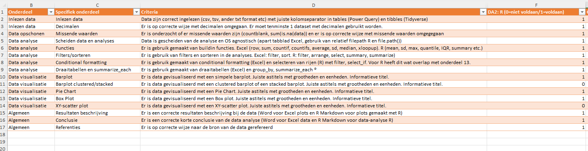

# Analyse calorieën van verschillende voedingsproducten

Naam student: Jannie Janssen  
Studentnummer: 123456  
Datum: 2025-04-10  

## Inleiding
In de huidige maatschappij is er een wijdverspreide bewustwording ten aanzien van voedselconsumptie. De kwantificering van calorische inname en de reductie van lipide consumptie vormen gangbare aanbevelingen van diëtisten en voedingswetenschappers. Daarom is kennis omtrent de nutriëntensamenstelling van diverse voedingsmiddelen van evident belang. De in dit rapport geanalyseerde dataset omvat een comma-separated values (CSV) bestand met gegevens van meer dan 300 voedingsmiddelen, waarbij voor elk item de kwantiteit van calorieën, lipiden, proteïnen, gesatureerde vetzuren, koolhydraten en voedingsvezels is geëtiketteerd. Bovendien zijn de voedingsmiddelen geclassificeerd in verschillende categorieën, zoals desserts, groenten, fruit, enzovoort.

## Dataset
De dataset komt van [Kaggle](https://www.kaggle.com/datasets/niharika41298/nutrition-details-for-most-common-foods). De dataset gebruikt [Wikipedia als referentie](https://en.wikipedia.org/wiki/Table_of_food_nutrients).


## Doel
Het primaire doel van de data-analyse van deze dataset is het kwantificeren en vergelijken van het caloriegehalte tussen verschillende voedselgroepen en binnen individuele voedselgroepen.
Specifiek beoogt de analyse de volgende inzichten te verschaffen:
•	Identificatie van de voedselgroep(en) met het gemiddeld hoogste caloriegehalte. Dit stelt ons in staat om te bepalen welke categorieën van voedingsmiddelen over het algemeen de grootste bijdrage leveren aan de totale energie-inname.
•	Identificatie van het specifieke voedingsmiddel binnen de voedselgroep met de hoogste gemiddelde hoeveelheid calorieën. Dit pinpoint individuele voedselitems die potentieel significant bijdragen aan een hoge calorieconsumptie.
•	Identificatie van het item binnen de hele dataset met het hoogste aantal calorieën.
•	Markeren van items met een hogere calorische hoeveelheid dan de mediaan.

## Inladen libraries

```{r}
library(tidyverse)
```


## Inladen van de data

Allereerst is de data bekeken in Visual studio code. Hieronder is een screenshot te zien.



Aan de file te zien betreft het een csv file met de komma als kolom separator. Decimalen gesepareerd met een punt.
Ik heb daarna de file ingeladen in R via `read_csv`:

```{r}
folder <- "data"
file_name <- "nutrients_csvfile.csv"
file_path <- paste0("../", folder, "/", file_name) # ../ betekent eerst een directory hoger
df1 <- read_csv(file_path)
head(df1)
```

Calories laadt niet goed. Als Character.
Zelfde probleem als eerder bij de Excel analyse.

Check voor de elementen.

```{r}
head(df1$Calories)
```

Welk item is dit?

```{r}
df1[df1$Calories == "8-44", ]
```


Ook hierbij dus elementen met een range (8-44).
Check of er ook blanks bij aanwezig zijn (die als NA zijn ingeladen):

```{r}
sum(is.na(df1$Calories))
```

Er blijkt 1 `NA` waarde ingelezen te zijn. Deze was blank en wordt door `read_csv` standaard als NA ingelezen.

Welk item is dit?

```{r}
df1[is.na(df1$Calories), ] 
```

Ook hierbij weer de Frozen Peas.

## Cleaning

De betreffende rijen verwijderen:

```{r}
df2 <- df1 %>% filter(!Calories == "8-44")
```


Check of rij weg is:

```{r}
df2[df2$Calories == "8-44", ]
```

Inderdaad verwijderd.

Nu de NA nog verwijderen:

```{r}
df3 <- df2 %>% filter(!Food == "Frozen peas")
```

Check of de rij weg is:

```{r}
df3[df3$Food == "Frozen peas", ]
```

Gelukt!

Nu de kolom op juiste datatype zetten:

```{r}
df4 <- df3 %>% mutate(Calories = as.numeric(gsub(",", "", Calories))) #gsub will remove the comma's.
head(df4)
```

Nu wordt Calories wel goed ingelezen.

## Identificatie van de voedselgroep(en) met het gemiddeld hoogste en laagste caloriegehalte 

Om de gemiddelden per categorie te berekenen wordt een nieuw dataframe gemaakt door eerst alle gelijke categoriewaarden te groeperen.
Daarna de `summarize_each` functie met de mean. Vervolgens de relevante kolommen selecteren. 

```{r}
df5 <- df4 %>%
  group_by(Category) %>%
  select(4) %>%
  summarize_each(funs(mean)) 
  
df5
```
Of via across (nieuwe manier):

```{r}
df5 <- df4 %>%
  group_by(Category) %>%
  summarise(across(Calories, mean)) 
df5
```


Nu een barplot maken van deze gegevens:

```{r}
p <- ggplot(data = df5, aes(x = Category, y = Calories)) +
  geom_bar(stat="identity", fill="steelblue") +
  labs(title="Average of calories from different categories") +
  theme(axis.text.x = element_text(angle = 90, hjust=1, vjust=0.5))
p
```

Te zien in deze grafiek is dat zaden en noten gemiddeld het hoogste en groenten gemiddeld het laagste aantal calorieën bevatten.

Om wat meer inzicht te krijgen in de spreiding van de data heb ik ook een Boxplot gemaakt:

```{r}
p <- ggplot(data=df4, aes(x = `Category`, y = `Calories`)) + 
  geom_boxplot() +
  labs(title="Calories for different food categories") +
  theme(axis.text.x = element_text(angle = 90, hjust=1, vjust=0.5))
p
```

Ook hierbij is te zien dat zaden en noten het hoogst uitkomen (hoogste mediaan). Brood en ontbijt laat een grote spreiding zien.

## Identificatie van het specifieke voedingsmiddel binnen de voedselgroep met de hoogste gemiddelde hoeveelheid calorieën

Om voedingsmiddelen te identificeren met het hoogste aantal calorieën binnen de hoogste gemiddelde categorie heb ik eerst gefilterd voor category seeds and nuts:

```{r}
df6 <- df4 %>% filter(Category == "Seeds and Nuts")
head(df6)
```

En vervolgens de barplot gemaakt:

```{r}
p <- ggplot(data = df6, aes(x = Food, y = Calories)) +
  geom_bar(stat="identity", fill="steelblue") +
  labs(title="Average of calories from different Food and Nuts items") +
  theme(axis.text.x = element_text(angle = 90, hjust=1, vjust=0.5))
p
```
Hieruit blijkt dat Brazil nuts en Roasted and salted als hoogste calorieen geklassificeerd kunnen worden.

Ik heb vervolgens ook een taartdiagram deze analyse gemaakt:


```{r}
p <- ggplot(data=df6, aes(x = "", y = Calories, fill = Food)) +
  geom_bar(stat="identity", width=1) +
  coord_polar("y", start=0) +
  labs(title="Average of calories from different Food and Nuts items") +
  theme_void() # remove background, grid, numeric labels
p
```

## Identificatie van het item binnen de hele dataset met het hoogste aantal calorieën.

Omdat er eerst per categorie gekeken is, zou het kunnen dat er een individueel item is dat een zeer hoge categorische waarde heeft maar niet in dezelfde categorie valt als de items die gemiddeld de hoogste categorische waarde hebben.
Daarom is er ook een analyse gedaan op de hoogste waarde en de laagste waarde.


De rij met de hoogste waarde:

```{r}
df4[df4$Calories == max(df4$Calories),]
```

De rij met de laagste waarde:

```{r}
df4[df4$Calories == min(df4$Calories),]
```


## Filteren van items met een hogere calorische hoeveelheid dan de mediaan.

Om te selecteren voor voedingsmiddelen met een hoge calorische waarde, heb ik de mediaan gebruikt. De mediaan is robuuster dan het gemiddelde en minder gevoelig voor een individuele uitbijter. Ik heb eerst de mediaan berekend van het aantal calorieën:

```{r}
med_val <- median(df4$Calories)
med_val
```

Het aantal rijen dat hoger is dan de mediaan:

```{r}
sum(df4$Calories > med_val)
```

Vervolgens heb ik gesorteerd voor rijen met colorieen hoger dan de mediaan. Vervolgens gesorteerd op calorieen van hoog naar laag:

```{r}
df7 <- df4 %>% 
  filter(Calories >  med_val) %>% 
  arrange(desc(Calories))
df7
```

## Conclusie en discussie:

De analyse van de caloriegehalten in meer dan 300 voedingsmiddelen, gecategoriseerd in diverse groepen, onthult significante variaties. Zaden en noten werden geïdentificeerd als de voedselgroep met het gemiddeld hoogste aantal calorieën, terwijl groenten gemiddeld het laagste caloriegehalte vertoonden. Binnen de categorie zaden en noten bleken Brazil nuts en geroosterde, gezouten noten de hoogste individuele calorieën te bevatten. Opvallend was de identificatie van pure plantaardige olie als het voedingsmiddel met het absolute maximum aan calorieën in de gehele dataset. Daarentegen werden er twee voedingsmiddelen met een caloriegehalte van nul geconstateerd. Door de mediaan van het caloriegehalte te berekenen en toe te passen voor conditionele formattering, werden de voedingsmiddelen met een relatief hoog caloriegehalte visueel gemarkeerd in de dataset. Deze bevindingen benadrukken het brede scala aan calorieën binnen verschillende voedselgroepen en individuele producten. De resultaten kunnen waardevol zijn voor consumenten die hun calorie-inname willen monitoren, evenals voor professionals in de voedingsindustrie en gezondheidszorg. De grote spreiding binnen sommige categorieën, zoals brood en ontbijtgranen, suggereert dat verdere, meer gedetailleerde analyses binnen deze groepen nuttig kunnen zijn.

## Verantwoording Checklist:



Te zien is dat er nog twee elementen in het portfolio ontbreken:
-	Clustered barplot
-	XY-scatterplot
