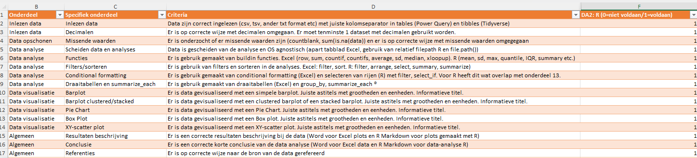

# Analyse calorieën van verschillende voedingsproducten

Naam student: Jannie Janssen  
Studentnummer: 123456  
Datum: 2025-04-10  

## Inleiding
Zomato is een belangrijke speler in de moderne voedselketen, met name in de distributie en consumptiefase. Een Master in Duurzame en Gezonde Voeding bestudeert de gehele voedselketen, van productie tot consumptie en afvalverwerking, met een focus op duurzaamheid en gezondheid. Het begrijpen van de economische aspecten van een bedrijf als Zomato kan relevant zijn binnen deze bredere context. De beurskoers van Zomato kan een indicator zijn van consumentengedrag en trends in de voedselbezorgingssector. 
De mate waarin Zomato gezonde en duurzame voedselopties aanbiedt en promoot, kan van invloed zijn op de beurskoers op de lange termijn, zeker gezien de groeiende consumentenbewustzijn. 


## Dataset
Deze dataset presenteert historische beurskoersinformatie voor Zomato, een toonaangevend online platform voor voedselbezorging en restaurantaggregatie. De dataset is samengesteld met gegevens verzameld over een specifieke periode, en toont de fluctuatie van de Zomato-aandelenkoersen over dagen, weken of maanden.
Bron: [Zomato Stock Price](https://www.kaggle.com/datasets/cheesecke/zomato-stock-price)


## Doel
Het primaire doel van de data-analyse van deze dataset is het volgen van de aandelenprijs in de tijd. Is er de laatste paar jaar een opwaartse of een neerwaartse trend te zien? Later kan dan gekeken worden of de mate waarin Zomato gezonde en duurzame voedselopties aanbiedt en promoot van invloed kan zijn op de aandelenkoers.

## Inladen libraries

```{r}
library(tidyverse)
```


## Inladen van de data

Allereerst is de data bekeken in Visual studio code. Hieronder is een screenshot te zien.


Aan de file te zien betreft het een csv file met de komma als kolom separator. Decimalen gesepareerd met een punt.
Ik heb daarna de file ingeladen in R via `read_csv`:

```{r}
folder <- "data"
file_name <- "zomato.csv"
file_path <- paste0("../", folder, "/", file_name) # ../ betekent eerst een directory hoger
df1 <- read_csv(file_path)
head(df1)
```
De data lijken goed geladen..


## Cleaning

Check of er geen NA in het data frame aanwezig is:

```{r}
dim(df1)
dim(drop_na(df1))
```

Bijde data frames hebben dezelfde dimensies.
Dus geen NA waarden.

Kan er gerekend worden met de aandelenprijzen?

```{r}
mean(df1$High)
```

De eerste kolom is ook van het date type.

Er bleek geen verdere cleaning nodig.


## Analyse van de aandelen prijs:

Om een XY-Scatter te kunnen maken moet de data eerst Tidy gemaakt worden:

```{r}
df2 <- df1 %>%
  gather(`High`, `Low`, key = "Type", value = "Price") 
head(df2)
```


Er is vervolgens een XY-scatter plot gemaakt van de aandelen prijzen:

```{r}
p <- ggplot(data= df2, aes(x = Date, y = Price, group = `Type`)) +
  geom_line(aes(color = `Type`)) +
  labs(title="Zoamto Stock Price")
p
```

Te zien is dat de aandelenprijs tussen februari en augustus 2022 gedaald is maar tussen maart en oktober weer gestegen is.

Er wordt een grouped barplot gemaakt om de verschillen tussen de laagste prijs, de mediaan en de hoogste prijs over deze hele periode zichtbaar te maken:

Eerst een data frame met de gegevens maken:

```{r}
high <- summary(df1$High)
low <- summary(df1$Low)
index <- c(1, 3, 6)
df3 <- tibble("Measurement" = c("Minimum", "Median", "Maximum"), 
               "low" = as.vector(low[index]),
               "high" = as.vector(high[index]))
df3 
```

Maak Tidy en Sorteer:

```{r}
df4 <- df3 %>%
  gather(`low`, `high`, key = "low or high", value = "Stock Price") 
df4
```

We kunnen de eerste twee kolommen aanpassen naar factoren die niveaus ondersteunen. Op die manier kunnen we de volgorde in het staafdiagram bepalen.


```{r}
df4$Measurement <- factor(df4$Measurement, levels = c("Minimum", "Median", "Maximum"), order = T)
df4
```

Hetzelfde geldt voor laag of hoog:

```{r}
df4$`low or high` <- factor(df4$`low or high`, levels = c("low", "high"))
df4
```


Nu een grouped barplot maken van deze gegevens:

```{r}
p <- ggplot(data = df4, aes(x = Measurement, y = `Stock Price`, fill = `low or high`)) +
  geom_bar(stat = "identity", position="dodge") +
  labs(title="Minimum, Median and maximum Stockprice") +
  theme(axis.text.x = element_text(angle = 45, hjust=1))
p
```


## Conclusie en discussie:

De analyse van Zomato's historische beurskoers toont significante fluctuaties in de aandelenprijs over de onderzochte periode. Een duidelijke daling was zichtbaar tussen februari en augustus 2022, gevolgd door een herstel en stijging van maart tot oktober. De spreiding tussen de laagste en hoogste dagelijkse aandelenprijzen is aanzienlijk, met een minimum rond de 40 dollar en een maximum rond de 150 dollar. Vervolgonderzoek kan zich richten op het verklaren van deze schommelingen, mogelijk in relatie tot factoren zoals marktomstandigheden en de mate waarin Zomato duurzame en gezonde voedselopties aanbiedt en promoot.

## Verantwoording Checklist:



Zoals te zien is zijn nu ook de laatste 2 onderdelen geïncludeerd. Namelijk:
-	Clustered barplot
-	XY-scatterplot
Hiermee is het R deel van mijn portfolio compleet.


